# Milestone Plan — FinHive MVP2

**Date**: 2026-09-08 · **Revision 2** (M1 split · M0 slimmed · encryption added · beautification deferred)
**Status**: FOR REVIEW
**Source**: `linear_import.csv` · 139 issues · 696 points
**Decisions**: `ARB_DECISIONS.md` · `mvp2_ard_v2.2.0.md` (ADR-2.3 encryption)

---

## The governing constraint

> **Business continuity is priority #1.** The MVP1 user validates real business on the
> `development` branch throughout. MVP1 functionality must not be affected.

Enforced mechanically, not by care:

| Mechanism | Where | Effect |
|---|---|---|
| **MVP1 regression gate** | M0, CI | Full MVP1 suite (150 + 22 smoke) on **every** PR, whatever paths changed |
| **MVP1 stays production** | M0 → M4 | Desktop app remains the system of record; the web app is validated alongside it |
| **Local-first M1** | M1a/M1b | Nothing hosted, nothing shared, nothing to break |
| **Parity sweep as a gate** | M1b exit | Persona A ~80 checks must report PARITY HELD |

---

## Milestone flow

```mermaid
flowchart TB
    subgraph BC["🔒 Business continuity — a property, not a phase"]
        direction LR
        BC1["MVP1 desktop remains the system of record"]
        BC2["MVP1 regression gate blocks every breaking PR"]
        BC3["M1 is local-only — nothing hosted can break"]
    end

    START(["Today · MVP1 live on development"]) --> M0

    M0["<b>M0 · Foundation &amp; Agent Toolchain</b><br/>15 issues · 59 pt<br/><br/>repo structure · orchestrator + run_builder<br/>CodeRabbit wired · GitHub Actions<br/>SQL-injection + import-linter gates<br/><b>MVP1 regression gate</b><br/><b>MVP1 multi-month ByMonth</b>"]

    M0 --> G0{{"Gate 0<br/>agents executable · CodeRabbit reviewing<br/>MVP1 suite green on every PR"}}

    G0 --> M1A["<b>M1a · Local Setup, Login &amp; Encryption</b><br/>23 issues · 110 pt<br/><br/>① setup — mac + windows, one command<br/>② login — service account, role=owner<br/>③ <b>encryption at rest + app-layer decrypt</b><br/>local schema · placeholders · Help"]

    M1A --> G1A{{"Gate 1a<br/>user logs in on their own machine<br/><b>no plaintext PII in the database file</b>"}}

    G1A --> M1B["<b>M1b · MVP1 Parity — Read then Write</b><br/>26 issues · 162 pt<br/><br/>④ read — Loans table, filters, totals<br/>⑤ write — entry, edit, Reports, Approvals<br/>multi-month ByMonth · parity sweep"]

    M1B --> G1B{{"Gate 1b<br/><b>Persona A · PARITY HELD</b><br/>MVP1 user validates business on the web app"}}

    G1B --> M2["<b>M2 · Agent Read-Only</b><br/>27 issues · 140 pt<br/><br/>LiteLLM · Groq · 7 read tools<br/>ReAct loop · SSE · trace UI<br/>mask before egress · pgvector RAG<br/>cost metering · evals"]

    M2 --> G2{{"Gate 2<br/>grounded answers · evals ≥ 90/85/85<br/>unsafe-call rate = 0"}}

    G2 --> M3["<b>M3 · Agent Write, UI Polish &amp; Hosted Infra</b><br/>20 issues · 96 pt<br/><br/>mutating tools propose, never write<br/>transactional apply · revert · OriginBadge<br/>component inventory · skeletons · empty states<br/>Supabase ap-south-1 · bom1 · RLS · Blob"]

    M3 --> G3{{"Gate 3<br/>zero direct agent writes, proven<br/>RLS isolation passes on hosted"}}

    G3 --> M4["<b>M4 · Multi-User Distribution</b><br/>12 issues · 60 pt<br/><br/>public signup · roles · invitations<br/>production deploy · Grafana · Amplitude<br/><b>collision validation</b> · Bot Readiness"]

    M4 --> G4{{"Gate 4<br/>Bot Readiness = READY<br/>no data or workflow collisions"}}

    G4 --> M5["<b>M5 · Completion &amp; Hardening</b><br/>16 issues · 69 pt<br/><br/>dbt contracts · real dashboard<br/>retention tiering · restore · purge<br/>DueSoon · MDX content"]

    M5 --> DONE(["MVP2 complete"])

    BC -.->|guards| M0 & M1A & M1B & M2 & M3 & M4

    style BC fill:#0f2e1f,stroke:#3ecf8e,color:#fff
    style M0 fill:#1f1f2e,stroke:#8b7ec8,color:#fff
    style M1A fill:#3d2914,stroke:#e0a336,color:#fff
    style M1B fill:#3d2914,stroke:#e0a336,color:#fff
    style M2 fill:#1a3a52,stroke:#4a9eff,color:#fff
    style M3 fill:#3d1f2e,stroke:#f472b6,color:#fff
    style M4 fill:#2e1f2e,stroke:#c084fc,color:#fff
    style M5 fill:#1f2e2e,stroke:#3ecf8e,color:#fff
    style G1A fill:#4a3a14,stroke:#e0a336,color:#fff
    style G1B fill:#4a3a14,stroke:#e0a336,color:#fff
```



---

## What changed in revision 2

| Change | Effect |
|---|---|
| **M0 slimmed** 27 → **15** issues (101 → 59 pt) | Repo, agents, CodeRabbit, CI gates, regression gate only |
| **M1 split** into M1a (110 pt) + M1b (162 pt) | A checkpoint at 110 pt instead of 264 |
| **Encryption replaces masking at rest** | 4 new tickets, +23 pt — the old approach failed parity check A2.1 |
| **Hosted infra → M3** | Supabase provisioning, RLS, `bom1`, `service_role`, SQLite→hosted migration, Blob |
| **Beautification → M3** | Component inventory (13), skeletons (5), empty states (5) — 23 pt off the parity path |
| **North Star spec → M4** | Belongs with Amplitude instrumentation, not before code |

### M0 · what stayed and what left

**Stayed** — exactly your four concerns: repo structure · developer agents executable (orchestrator, run_builder, pr_gate, agent contract) · CodeRabbit wired · GitHub Actions + SQL-injection + import-linter gates · MVP1 regression gate. Plus MVP1 multi-month ByMonth, which changes the live system and belongs early behind the gate.

**Left** — Supabase provisioning, RLS policies, RLS isolation test, `service_role` restriction, SQLite→Supabase migration, `bom1` pinning, region assertion → **M3**. Local schema work (migration runner, `orgs`/`users`, MVP1 schema) → **M1a**, because the app cannot store a loan without it.

### M1a build order follows your priority

**setup → login → encryption → read → write**

Encryption lands *before* any real data is written. No row is ever stored in plaintext, and there is no backfill.

---

## Exit gates

| Gate | Criteria |
|---|---|
| **G0** | CI green · developer agents run a queued issue end to end · CodeRabbit blocking findings prevent merge · MVP1 suite passes on every PR |
| **G1a** | App runs locally on mac and windows from one command · MVP1 user logs in as owner · **no plaintext PII in the database file, index or WAL** · tampered ciphertext rejected |
| **G1b** | **Persona A: PARITY HELD** · Loans, Reports, Approvals fully functional · multi-month ByMonth matches MVP1 · no ❌ in A5 (calculations) or A8 (infrastructure) |
| **G2** | Three canonical queries answered with grounded output · tool-selection ≥ 90%, argument ≥ 85%, completion ≥ 85% · p95 ≤ 4s · **unsafe-call = 0** |
| **G3** | Every mutating tool proposes, never writes · batch apply transactional · agent-class invariant enforced · **RLS isolation passes on hosted** |
| **G4** | Bot Readiness **READY** · second user onboarded with no data or workflow collisions |

---

## Concerns worth your attention

### 1 · One place I did not fully defer the data work

**`org_id` stays NOT NULL on every table from M1a's first migration**, even though RLS is off until M3.

Deferring the *policy* is cheap. Deferring the *column* is not — adding tenancy later means a schema migration plus a backfill across every table, on data the user is actively working in. The column costs nothing now and turns M3's RLS work into adding policies rather than reshaping the schema.

### 2 · How I read "delay all database migrations"

As **defer hosted database work, keep the local schema**. M1a keeps the migration runner, `orgs`/`users` and the MVP1 schema, because M1b cannot read or write a loan without them. Everything Supabase-hosted moved to M3.

If you meant no schema work at all in M1, then M1b collapses to a login screen — say so and I will re-cut again.

### 3 · Encryption interacts with three existing decisions

Detail in ADR-2.3. In short:

- **Cursor pagination (#05)** — a cursor needs a DB-orderable key, and ciphertext is not one. Cursors work on `due_date`, `amount`, `reference_id`, `created_at`; sorting by an encrypted column paginates in the app. Bounded at 1,500 rows.
- **dbt marts (M5)** — cannot `GROUP BY` an encrypted name. Borrower aggregation groups by blind index; the display name is decrypted at read.
- **Agent masking (M2)** — the order becomes ciphertext → decrypt → real name → mask to `PERSON_1` → LLM. Two protections at two boundaries. Never mask ciphertext; never let a decrypted name skip the masker.

### 4 · M3 now carries three unrelated workstreams

Agent-write (9), UI polish (3), hosted infra (8). That is where each was individually placed, and it makes M3 the most crowded milestone after M2. It splits cleanly along those seams if it feels wrong on review — say the word.

### 5 · Three decisions still open

| # | Question | Recommendation |
|---|---|---|
| 09 | Encryption mechanism | **AES-256-GCM + HMAC blind index** (ADR-2.3) |
| 10 | Encrypt group fields too? | **Yes** — a business name identifies a business |
| 05 | Cursor pagination scope | **Non-encrypted sort keys only** |

---

## Import

Row order **is** build order — issues are created top to bottom so Linear numbering runs in milestone sequence. Do not sort the file.

```bash
python3 ops/seed_linear.py --milestone M0
```

Then, per milestone or all at once:

```bash
LINEAR_API_KEY=lin_api_xxx LINEAR_TEAM_KEY=FIN python3 ops/seed_linear.py --apply
```
