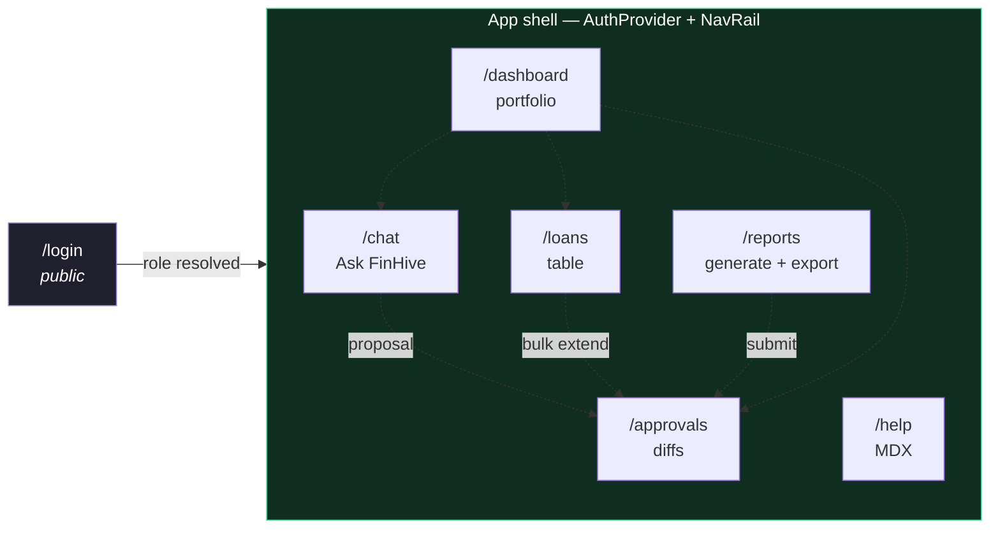
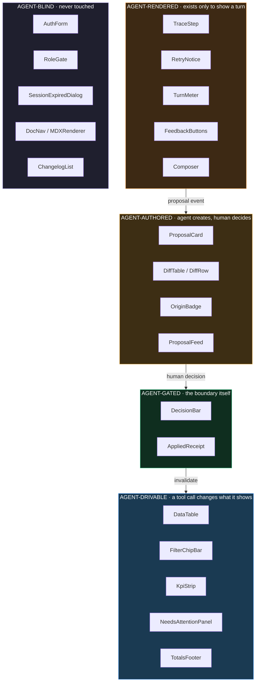

# Architecture Reference Document — FinHive Loan Manager MVP2

**Version**: 2.1.0
**Status**: DRAFT — for your review before the backlog is re-cut
**Date**: 2026-09-07
**Extends**: `mvp2_ard_v2.0.0.md` (not superseded — read that first for the system architecture)
**Design source**: `FinHive MVP2 - Design Spec.dc.html` · 7 screens · 38 bindings · 31 components · 8 states
**Audience**: Architecture Review Board, Junior Engineers implementing the component layer

---

## What v2.1.0 adds

v2.0.0 settled the **system**: layers, services, persistence, auth, the agent loop, the approval gate, CI. It did not settle the **interface contract** — which screens exist, what each visible element is bound to, or which components the agent may touch.

The design spec answers those. This version folds them in and adds one thing the spec does not: **a formal classification of every component by its relationship to the ReAct loop**, so "can the agent affect this?" becomes a declared, lintable, testable property rather than a convention.

| | v2.0.0 | v2.1.0 |
|---|---|---|
| Screens | 4 (dashboard, loans, chat, approvals) | **7** (+ login, reports, help) |
| API surface | ~10 endpoints, sketched | **38 bindings**, request + response + model |
| Components | named in prose | **31**, with props, owned state, variants |
| SSE events | 5, informal | **6**, typed contract |
| Non-happy paths | risk register entries | **8 designed states** with contract signals |
| Agent/component relationship | implicit | **explicit taxonomy + invariant** (§4) |
| Tool registry | 9 tools | **11**, with documented exclusions (§5) |
| Role divergence | a permissions table | **per-screen matrix** with enforcement point (§8) |

---

## Table of Contents

1. [Screen inventory](#1-screen-inventory)
2. [API contract surface](#2-api-contract-surface)
3. [SSE event contract](#3-sse-event-contract)
4. [The ReAct component contract](#4-the-react-component-contract) ← the new architectural idea
5. [Tool registry v2](#5-tool-registry-v2)
6. [Component inventory](#6-component-inventory)
7. [Non-happy states as designed screens](#7-non-happy-states-as-designed-screens)
8. [Role variants](#8-role-variants)
9. [Token sheet](#9-token-sheet)
10. [Decisions required from you](#10-decisions-required-from-you)
11. [Reconciliation with v2.0.0](#11-reconciliation-with-v200)
12. [Backlog delta](#12-backlog-delta)

---

## 1. Screen inventory

Seven routes. Three are new since v2.0.0.



| Route | Purpose | New? | Rail | Notes |
|---|---|---|---|---|
| `/login` | Auth + role bootstrap | **New** | ✗ | The only screen without the shell. Role is resolved once and cached. |
| `/dashboard` | Portfolio overview | — | ✓ | KPI strip reads the **dbt mart**, not `loans` — a dashboard number and a report number cannot disagree |
| `/loans` | Table, filter, inline edit | — | ✓ | Filter state as the single visible source of truth |
| `/chat` | ReAct trace | — | ✓ | The trace is the product, not a loading state |
| `/approvals` | Mutation diffs | — | ✓ | Renders from stored JSONB snapshots, never agent prose |
| `/reports` | Generate, poll, export | **New** | ✓ | The only screen on the async 202 path |
| `/help` | MDX docs + changelog | **New** | ✓ | No API surface; build-time manifest only |

**Why the three additions matter architecturally**:

- `/login` forces `GET /api/me` into existence — role and org must be resolved server-side once, not inferred per-request in the client. This is the screen that makes §8's RLS model real.
- `/reports` is the only place the serverless timeout ceiling (v2.0.0 §7 gotcha 1) becomes user-visible. It proves the 202 job path rather than deferring it.
- `/help` is the only route with zero authorization. That makes it the natural target for the Bot Readiness crawl (`/e2e bot`, §C5) — and the one place a public-index decision has to be made.

---

## 2. API contract surface

38 bindings. Consolidated by resource; every one traceable to a screen pin in the design spec.

### Identity

| Method | Path | Request | Response | Model |
|---|---|---|---|---|
| — | `supabase.auth.signInWithPassword` | `{email, password}` | `{access_token, refresh_token, expires_at, user}` | `SessionDTO` (SDK type) |
| — | `supabase.auth.refreshSession` | `{refresh_token}` | `SessionDTO \| 401` | `SessionDTO` |
| `GET` | `/api/me` | Bearer JWT | `{user_id, org_id, org_name, role, features[]}` | `MeResponse` |

> `MeResponse.features[]` is a forward hook — it lets a capability be dark-launched without a client release. Not used at launch; costs nothing to include now and is a breaking change to add later.

### Loans

| Method | Path | Request | Response | Model |
|---|---|---|---|---|
| `GET` | `/api/loans` | `?status&borrower_group&due_from&due_to&q&sort&cursor&limit` | `{items: LoanSummary[], total, totals: LoanTotals, next_cursor}` | `LoanFilterParams → LoanListResponse` |
| `GET` | `/api/loans/{reference_id}` | — | `{loan: LoanDetail, history: LoanHistoryEntry[]}` | `LoanDetailResponse` |
| `POST` | `/api/loans` | `{borrower_name, borrower_group, depositor_name, depositor_group, amount, giving_date, due_period}` | `201 {loan}` \| `422` | `LoanCreateRequest → LoanResponse` |
| `PATCH` | `/api/loans/{reference_id}` | `{...fields}` · `If-Match: <version>` | `200 {loan}` \| `409 stale` \| `422` | `LoanUpdateRequest → LoanResponse` |
| `POST` | `/api/loans/extend` | `{reference_ids[], periods, reason?}` | `202 {batch_id, count, status}` | `LoanExtendRequest → ProposalBatchResponse` |
| `GET` | `/api/portfolio/summary` | `?period&as_of` | `{total_outstanding, active_count, borrower_count, overdue_amount, overdue_count, oldest_overdue_days, due_this_period, maturing_count}` | `PortfolioSummaryResponse` |

> **`LoanTotals` in the list response is not decoration.** The footer restates the filtered totals from the same payload — no second call, and no chance of the table and the total disagreeing. This is the direct answer to MVP1's worst class of defect: a wrong filter that looked right.

> **`POST /api/loans/extend` returns 202, not 200.** A bulk extend is a *proposal*, even when a human initiated it from the table. Form-originated and agent-originated writes converge on the same gate; only the `OriginBadge` differs. That symmetry is what keeps §12 honest — there is no second, unaudited write path.

### Agent

| Method | Path | Request | Response | Model |
|---|---|---|---|---|
| `GET` | `/api/agent/sessions` | `?limit` | `{items: [{id, title, last_turn_at, turn_count}]}` | `AgentSessionListResponse` |
| `POST` | `/api/agent/stream` | `{session_id?, message}` | `text/event-stream` of `ReActEvent` | `AgentTurnRequest → ReActEvent` |
| `GET` | `/api/agent/suggestions` | `?surface` | `{items: [{id, label, prompt}]}` | `SuggestionsResponse` |
| `POST` | `/api/agent/turns/{turn_id}/feedback` | `{sentiment, note?}` | `204` | `FeedbackRequest` |

### Approvals

| Method | Path | Request | Response | Model |
|---|---|---|---|---|
| `GET` | `/api/approvals` | `?status&cursor&limit` | `{items: ProposalSummary[], total, next_cursor}` | `ApprovalListResponse` |
| `GET` | `/api/approvals/{batch_id}` | — | `{batch_id, operation, items: [{target_ref, before_state, after_state, diff: FieldDiff[]}]}` | `ProposalDetailResponse` |
| `POST` | `/api/approvals/{batch_id}/approve` | `{note?}` | `200 {applied_ids[], transaction_id, applied_at}` \| `403` | `ApprovalDecisionRequest → ApprovalResultResponse` |
| `POST` | `/api/approvals/{batch_id}/reject` | `{reason}` | `200 {batch_id, status}` | `ApprovalDecisionRequest` |
| `POST` | `/api/approvals/{batch_id}/revert` | `{reason}` | `200 {transaction_id}` | `RevertRequest → ApprovalResultResponse` |

> The server computes `diff: FieldDiff[]` and sends it alongside the raw snapshots. The client must **not** derive the diff itself — two diff implementations will disagree eventually, and the one the user approves must be the one the server applies.

### Reports

| Method | Path | Request | Response | Model |
|---|---|---|---|---|
| `GET` | `/api/reports` | `?status&cursor&limit` | `{items: ReportSummary[], total, next_cursor}` | `ReportListResponse` |
| `POST` | `/api/reports` | `{mode, period_type, interest_rate, commission_rate, reference_ids[]}` | `202 {job_id, poll_after_ms}` \| `200 {report}` if small | `ReportGenerateRequest → JobAcceptedResponse` |
| `GET` | `/api/reports/jobs/{job_id}` | — | `{state, progress, report_id?, error?}` | `JobStatusResponse` |
| `GET` | `/api/reports/{report_id}/records` | `?cursor&limit` | `{items: ReportRecord[], totals: ReportTotals}` | `ReportRecordListResponse` |
| `POST` | `/api/reports/{report_id}/export` | `{format: "pdf"}` | `200 {blob_url, expires_at, bytes}` | `ExportRequest → ExportResponse` |
| `POST` | `/api/reports/{report_id}/submit` | — | `202 {batch_id, count, status}` | `ProposalBatchResponse` |

### Admin & static

| Method | Path | Response | Model |
|---|---|---|---|
| `GET` | `/api/admin/dbt/status` | `{passed, total, last_run_at, failing[]}` | `DbtStatusResponse` |
| `GET` | `/content/index.json` | `{sections: [{slug, title, order, children[]}]}` | `DocIndex` (build-time) |
| `GET` | `/content/changelog.json` | `{entries: [{version, date, items[]}]}` | `ChangelogFeed` (build-time) |

> ⚠️ **Model names are proposed, not reconciled.** The design sync read the repo at `main`, which currently contains only `.gitignore` and `LICENSE` — **the MVP1 source lives on `development`**. Every Pydantic name above is a proposal. Reconcile against `finhive/` once it lands. See §11.

---

## 3. SSE event contract

`POST /api/agent/stream` → `text/event-stream`.

| Event | Shape | Kind | Renders as |
|---|---|---|---|
| `thought` | `{step: int, text: str}` | reason | `TraceStep` variant=thought |
| `action` | `{step: int, tool: str, args: dict}` | act | `TraceStep` variant=action |
| `observation` | `{step: int, data: dict, ms: int, retry?: int, validation_error?: str}` | act | `TraceStep` variant=observation, `RetryNotice` when `retry` present |
| `proposal` | `{batch_id: uuid, count: int, operation: str}` | final | `ProposalCard` + invalidates the approvals query |
| `final` | `{answer: str, truncated?: bool, reason?: str, metrics: TurnMetrics}` | final | Answer + `TurnMeter` + `FeedbackButtons` |
| `error` | `{code: str, message: str, recoverable: bool}` | final | `TraceStep` variant=degraded, or the budget-block state |

**Ordering guarantees**:
- `thought` → `action` → `observation` repeats, at most `MAX_STEPS = 6` times
- exactly one terminal event (`final` or `error`) per turn
- `proposal` may appear at most once, always before `final`

**Client contract**: the client accumulates `ReActStep[]` and never re-fetches the trace. If the connection drops mid-turn, the turn is lost and re-asked — the trace is not resumable. That is a deliberate simplification at 3 DAU; the persisted `agent_turns.react_trace` row is the durable record, not the stream.

**Verbosity** is a client-side filter over `kind`, not a server parameter. Three levels — full / actions+observations / final only — and the server always sends everything so the persisted trace is complete regardless of what the user chose to watch.

---

## 4. The ReAct component contract

**The new architectural idea in this version.**

v2.0.0 §12 established that the agent proposes and never writes. That rule lives in the tool dispatcher. But once you have 31 components, "can the agent affect this?" becomes a question about the *UI tree*, and a rule that lives only in the backend cannot answer it.

So: every component declares its relationship to the agent.



### The five classes

| Class | Definition | The rule |
|---|---|---|
| **Agent-rendered** | Has no meaning outside a turn. Renders model output directly. | Must treat all content as untrusted text. Never `dangerouslySetInnerHTML`. |
| **Agent-authored** | The agent produced the underlying data; a human decides what happens to it. | Must render from the **server's** structured data (`before_state`/`after_state`/`FieldDiff`), never from the agent's prose. |
| **Agent-drivable** | A tool call changes what it displays, but the component is agent-agnostic — it just re-queries. | Must be identical whether the change came from a form or a turn. No agent-specific branch. |
| **Agent-gated** | It *is* the boundary. | Must never appear inside an agent-rendered subtree. Its action must be authorized server-side, independent of its own render. |
| **Agent-blind** | Never touched by the agent under any circumstance. | Must not import from `finhive/agent` or subscribe to agent state. |

### The invariant

> **An agent-gated component may never be rendered inside an agent-rendered subtree.**

If `DecisionBar` could render inside `TraceStep`, the agent would control the pixels of its own approval control. That is the UI-layer equivalent of letting the agent write to the database, and it is exactly the kind of thing that gets added innocently in a "put approve right in the chat" ticket.

This is enforceable, not aspirational:

```ts
// components/registry.ts — every component declares its class
export const AGENT_CLASS = {
  TraceStep:    'rendered',
  ProposalCard: 'authored',
  DiffTable:    'authored',
  DataTable:    'drivable',
  DecisionBar:  'gated',
  AuthForm:     'blind',
} as const;
```

```js
// eslint-local-rules/no-gated-in-rendered.js
// Fails CI when a 'gated' component appears in the JSX of a 'rendered' one.
```

Plus a runtime assertion in dev, and a Playwright check: with a pending proposal open in `/chat`, `[data-agent-class="gated"]` must have count 0 inside `[data-testid="react-trace"]`.

### Why this is worth the ceremony

Three reasons, in the order the ARB will care about them:

1. **It makes a safety property visible in the code.** A junior engineer adding "approve from chat" hits a failing lint rule with a named reason, rather than shipping it and hoping review catches it.
2. **It tells you what to test.** Agent-rendered components need injection tests. Agent-authored need server-truth tests. Agent-gated need server-side authz tests. Agent-blind need a "does not import agent" test. The taxonomy generates the test plan.
3. **It survives growth.** At 31 components a convention holds. At 80 it does not. Declaring the property now costs a line per component.

### Provenance is not status

`OriginBadge` marks *where a change came from* — `AGENT` (amber) or `FORM` (blue). It is deliberately not a status.

A bookkeeper reviewing a queue needs to know provenance to calibrate scrutiny, and the amber token means one thing everywhere: *a model originated this*. Same badge on a chat proposal, a dashboard feed row, and an approval header. Never reused for anything else.

---

## 5. Tool registry v2

Nine tools in v2.0.0. Two additions, and — more importantly — three **documented exclusions**.

### Registry

| Tool | Mutating | Min role | Rationale |
|---|---|---|---|
| `get_current_context` | ✗ | viewer | Today, quarter boundaries, org |
| `resolve_entity` | ✗ | viewer | Fuzzy → canonical, RAG-backed |
| `query_loans` | ✗ | viewer | Filtered search |
| `get_portfolio_summary` | ✗ | viewer | Reads the dbt mart |
| `calculate_interest` | ✗ | viewer | Preview only, no persistence |
| **`list_reports`** | ✗ | viewer | **New** — `/reports` exists now; "did last month's report go through?" is a natural question |
| **`search_help`** | ✗ | viewer | **New** — RAG over the `/help` MDX so the agent answers "how does extend work?" from the actual docs, not from the model's memory of them |
| `create_loan` | ✓ | bookkeeper | Proposes |
| `update_loan` | ✓ | bookkeeper | Proposes |
| `extend_loan` | ✓ | bookkeeper | Proposes |
| `generate_report` | ✓ | bookkeeper | Proposes |

`search_help` is the higher-value of the two. It closes the loop where the agent is *most* likely to hallucinate — questions about the product's own rules — by grounding them in versioned MDX that ships with the code.

### Deliberate exclusions

| Not a tool | Why |
|---|---|
| `approve_batch` | The agent must never operate its own gate. This is the single most important exclusion in the system. |
| **`revert_batch`** | Revert undoes an *approved, applied* change. A hallucinated revert silently rolls back a decision a human made deliberately — strictly worse than a hallucinated proposal, because no second human sees it. Revert stays a human action on a human-visible receipt. |
| `export_report` | Writes a file to Blob and costs money per call. A looping agent could fill the store. The user clicks Export. |

> Add these three as explicit `# NOT A TOOL:` comments in `finhive/agent/registry.py` with the reason. The absence of a tool is invisible; the reason for its absence should not be.

---

## 6. Component inventory

31 components. Variants are the contract — a component without its states designed is a component that will be improvised under deadline.

| Component | Variants | Agent class |
|---|---|---|
| `Button` | primary · secondary · ghost · icon · destructive × idle/hover/pressed/loading/disabled | blind |
| `StatusChip` | Active · Overdue · Pending · Paidoff · **DueSoon** | drivable |
| `OriginBadge` | AGENT · FORM | authored |
| `FilterChip` | applied · removable · overflow "+3 more" | drivable |
| `KpiCard` | neutral · warn · danger · skeleton | drivable |
| `DataTable` | comfortable · compact · skeleton · empty · error | drivable |
| `TableRow` / `LoanRow` | default · hover · selected · editing · saving · conflict | drivable |
| `Input` / `DateField` | idle · focus · invalid · disabled · inline-edit | blind |
| `SegmentedControl` | 2 · 3 · 4 segments | blind |
| `TraceStep` | thought · action · observation · retry · degraded | **rendered** |
| `RetryNotice` | attempt 1 · attempt 2 · degraded | **rendered** |
| `TurnMeter` | inline · expanded · over-budget | **rendered** |
| `FeedbackButtons` | unvoted · up · down | **rendered** |
| `Composer` | idle · streaming · capped · read-only | **rendered** |
| `DiffRow` | changed · added · removed · unchanged · type-mismatch | **authored** |
| `DiffTable` | changed · added · removed · no-op | **authored** |
| `ProposalCard` | pending · approved · rejected · applying | **authored** |
| `ProposalFeed` | owner · non-owner · empty | **authored** |
| `DecisionBar` | owner · read-only · applying · applied | **gated** |
| `AppliedReceipt` | applied · reverted | **gated** |
| `Drawer` | right · full-height · with tabs | blind |
| `Dialog` | confirm · destructive · session-expired | blind |
| `Toast` | success · warning · error · undo | blind |
| `Skeleton` | text · row · card · trace | blind |
| `EmptyState` | no data · no results · no permission · error | blind |
| `JobProgress` | queued · running · done · failed | blind |
| `Pagination` | cursor "load more" · page size | drivable |
| `AuthForm` | idle · submitting · error | **blind** |
| `RoleGate` | hide · disable · redirect | **blind** |
| `NavRail` | expanded · collapsed | blind |
| `DataHealthBadge` | pass · degraded · stale | blind |

> **`DiffRow` variant `type-mismatch` is the one to notice.** It exists because `before_state`/`after_state` are JSONB — the schema can drift between when a proposal was written and when it is approved. The design treats that as a rendered state rather than a crash. That is the right call and it needs a test.

---

## 7. Non-happy states as designed screens

Eight states. Each has a trigger, a treatment, and a **contract signal** — so the client can distinguish them without string-matching an error message.

| State | Screens | Trigger | Treatment | Signal |
|---|---|---|---|---|
| Loading / skeleton | dashboard, loans, reports | `isPending` — near-certain on a Vercel cold start | Skeleton in the **real row geometry**, never a centred spinner. No layout shift when data lands. | none — shape known from the model |
| SSE streaming | chat | first event ~400ms after POST | Steps append as they arrive; composer disabled; caret pulse on the open step | `X-Accel-Buffering: no` · `Cache-Control: no-transform` |
| Step-cap degraded | chat | `MAX_STEPS = 6` exhausted | Partial answer + two concrete rewrites of the question. **Never a timeout error.** | `final {truncated: true, reason: "step_cap"}` |
| Tool validation retry | chat | Pydantic `ValidationError` on a tool call | Collapsed line in the trace: *"corrected due_date — was 'next quarter'"*. Shown, not hidden. Two attempts, then degrade. | `observation {retry: 1, validation_error}` |
| Empty result | loans, approvals, reports, chat | zero rows for a valid query | Restates the filter that produced nothing and offers to clear it. On chat, the agent names the filter it applied. | `200 {items: [], total: 0}` |
| 401 / session expired | all authed | JWT expired, refresh failed | Modal over the frozen screen; **unsaved inline edits held and replayed after re-auth**. No route change. | `401 {code: "token_expired"}` |
| RLS denied | approvals | non-owner opens a pending batch | Diff fully visible; `DecisionBar` replaced by *"Only the account owner can approve"* + request-approval action. **Button absent, not disabled-with-a-tooltip.** | `403 {code: "rls_denied", required_role}` |
| Cost budget soft block | chat, dashboard | per-user daily spend > $0.50 | Composer goes read-only with remaining budget stated **and a form-based path to the same task**. Owner notified. | `429 {code: "budget_soft_block", resets_at, spend_usd}` |

Three of these are stronger than what v2.0.0 specified and are worth calling out:

- **Empty result on `/chat`** — *"a zero-row answer must never read as 'none exist'"*. If the agent filtered on `sharma_traders` and found nothing, saying "no loans found" is a lie by omission. It must name the filter. This is the failure mode that destroys trust in an agent fastest.
- **401 replay** — holding unsaved inline edits across re-auth. MVP1 existed partly to stop silent data loss; a session expiry that discards a half-typed row would reintroduce it.
- **Budget soft block offering the form path** — a cost cap that just says "no" makes the product feel broken. Routing the user to the same outcome without the model is the difference between a limit and a wall.

---

## 8. Role variants

| Screen | Owner | Bookkeeper | Viewer | Enforced by |
|---|---|---|---|---|
| `/login` | Full | Full | Full | role from JWT claim at `/api/me` |
| `/dashboard` | All KPIs + approval feed | All KPIs; feed read-only | KPIs only; feed hidden | RLS on `reports`, `proposed_mutations` |
| `/loans` | Read, create, edit, bulk extend | Read, create, edit, bulk extend | Read only; edit + New loan absent | RLS `FOR INSERT/UPDATE` on `loans` |
| `/chat` | All 11 tools | All 11 tools | Read-only tools only (7 of 11) | `required_role` on `@tool` |
| `/approvals` | Read, approve, reject, revert | Read + request approval | Read only | `reports_approve_owner_only` policy |
| `/reports` | Generate, submit, export | Generate, submit, export | Read + export only | RLS + route-level role check |
| `/help` | Full | Full | Full | static — no authorization |

> **The design spec states the principle better than v2.0.0 did**: *"The UI hides what RLS already refuses. The refusal is the control; the hiding is courtesy."*
>
> Adopt that sentence verbatim as the authorization doctrine. It implies the e2e rule already in the testing skill: every role restriction gets tested **at the API**, not by asserting a button is hidden.

Note the tool count shifted: 7 of 11 are read-only after adding `list_reports` and `search_help`, up from 5 of 9.

---

## 9. Token sheet

### Status semantic tokens

| Token | Light (MVP1 value) | Dark (re-tint) | Meaning |
|---|---|---|---|
| `status.active` | `#025c33` | `#0a7d47` | Loan within term |
| `status.overdue` | `#6b0307` | `#8f0a10` | Past due date |
| `status.pending` | `#804001` | `#a35502` | Awaiting approval |
| `status.paidoff` | `#022a52` | `#03407a` | Settled, archived |
| `brand.agent` | `#e0a336` | `#e0a336` | **Provenance, not status** |

Light mode uses MVP1's `dark_config.json` values verbatim. That is the continuity guarantee: the colour a user learned in the desktop app means the same thing in the web app.

### Type scale

| Token | Spec | Use |
|---|---|---|
| `display` | 25 / 1.1 / 600 | KPI figures — tabular, tight tracking |
| `heading.page` | 17 / 1.3 / 600 | Route title |
| `heading.card` | 13.5 / 1.3 / 600 | Panel titles |
| `body` | 13 / 1.55 / 400 | Row labels, prose, agent answers |
| `body.mono` | 12 / 1.5 / 400 | Reference IDs, money, dates — `tnum` |
| `caption` | 11.5 / 1.5 / 400 | Secondary metadata |
| `overline` | 10.5 / 1.2 / 500 | Column heads, uppercase, +0.4 tracking |

### ⚠️ `DueSoon` — a fifth status that must not be a fifth status

`StatusChip` has five variants. MVP1's `StatusEngine` has **four**, and it is 100%-tested, correct, and the thing this rewrite is contractually obliged not to break.

**Decision (recommended, needs your confirmation)**: `DueSoon` is a **derived display state**, never a persisted one.

- `StatusEngine.compute()` keeps returning exactly four values. Untouched. Its tests keep passing unchanged.
- `DueSoon` is computed in the dbt mart (`Active` + `due_date` within N days) and returned as a separate `is_due_soon: bool` field — or computed client-side from `due_date`.
- `StatusChip` renders `DueSoon` when `status === 'Active' && is_due_soon`.
- Nothing writes `"DueSoon"` to `loans.status`. A CHECK constraint enforces it.

If `DueSoon` becomes a real status, the four-value engine, its tests, the transition matrix, and the recompute-on-launch behaviour all change — and the e2e parity sweep (§A3) starts failing for a good reason, which is the worst kind of failing test.

**N is undecided.** 7 days? 14? It belongs in config, not code.

---

## 10. Decisions required from you

The design spec raised five. Three of mine from v2.0.0 §24 are still open. Recommendations for all eight.

| # | Question | Recommendation | Consequence of the alternative |
|---|---|---|---|
| **01** | May a `viewer` invoke the agent? | **Yes — read-only tools (7 of 11).** A viewer asking "what's overdue?" is the cheapest possible demonstration of the product's value. | If no: `/chat` loses its composer for viewers, and the registry drops its viewer tier. Simpler, but a viewer becomes a read-only spreadsheet user. |
| **02** | Optimistic concurrency on inline edit? | **Yes — `If-Match` + `409`.** At 3 DAU collisions are rare, but the failure mode of last-write-wins is *silently losing a bookkeeper's edit* — precisely what MVP1 existed to eliminate. Cost is one version column and one designed state you already have (`LoanRow` variant `conflict`). | Last-write-wins is ~2 days cheaper and reintroduces the original problem. |
| **03** | Report size threshold for the 202 path | **100 records.** Freeze it as `REPORT_ASYNC_THRESHOLD = 100`, referenced by the Playwright fixture boundary so the sync and async paths are both exercised. | An unfrozen number means one path never gets tested. |
| **04** | Is `revert` a first-class endpoint? | **Yes — `POST /api/approvals/{batch_id}/revert`.** §12 promised reversibility; without a route that promise is "someone writes SQL against production", which is not a control. **And it is not an agent tool** (§5). | Manual DB operation under pressure, unaudited, by whoever has credentials. |
| **05** | Cursor or offset pagination? | **Cursor, all six list endpoints.** Offset is easier against raw SQL but produces duplicate and skipped rows under concurrent writes — and the approval queue mutates while you read it. Pick one and apply it uniformly; mixed pagination is the worst outcome. | Offset saves ~1 day and creates a subtle correctness bug in exactly the list that matters most. |
| **06** | Data residency (from v2.0.0) | **Still open — blocks Supabase provisioning (P1).** If SMB customers are India-based, `ap-south-1`. | Migrating a provisioned project later is a re-provision, not a setting. |
| **07** | Audit retention on `proposed_mutations` | **24 months**, then archive the JSONB snapshots to Blob. Full before/after per batch grows faster than the loans table. | Indefinite retention is fine for a year and then quietly becomes the largest table. |
| **08** | `DueSoon` as derived vs persisted | **Derived. Never persisted.** (§9) | The MVP1 status engine, its tests, and the parity sweep all change. |

---

## 11. Reconciliation with v2.0.0

### Additive — no conflict

New screens, endpoints, components, states, and the agent-class taxonomy. All extend v2.0.0 without contradicting it.

### Extended

| v2.0.0 said | v2.1.0 says |
|---|---|
| "reversible because `before_state` is retained" | names the route, and excludes it from the tool registry |
| "report generation over >100 records → 202" | freezes 100 as a constant and a test boundary |
| approval gate for agent writes | **form-originated bulk writes use the same gate** — one write path, `OriginBadge` distinguishes them |
| status colours as Chakra semantic tokens | adds `brand.agent` as provenance, and the `DueSoon` derived-state rule |
| 9 tools | 11, with three documented exclusions |

### Open findings

1. **`main` has no source.** The design sync read the repo at `main` and found only `.gitignore` and `LICENSE`. MVP1 lives on `development`. Two consequences: every Pydantic model name in §2 is a *proposal* awaiting reconciliation against `finhive/`; and v2.0.0 §7 describes `main` as "always deployable", which is currently true only in the degenerate sense. Decide whether MVP1 lands on `main` before MVP2 work starts.

2. **The spec document's aesthetic is not the product's.** The spec sheet is set in the *Classical* design system — Cormorant Garamond over Lora, light editorial ground, gold `#b68235`. The **product screens inside it remain the dark direction** (`--pbg: #0b0e13`) with a `lightScreens` toggle. Do not let Classical leak into the app theme; it is the documentation voice, and the product's token set is §9.

---

## 12. Backlog delta

New or changed work implied by this version. Reflected in `linear_import.csv`.

| Area | New tickets | Notes |
|---|---|---|
| `/login` + identity | 4 | AuthForm, AuthProvider, RoleGate, `GET /api/me`, SessionExpiredDialog with edit replay |
| `/reports` | 6 | ReportForm, 202 job path, JobProgress polling with backoff, records preview, PDF export via Blob, submit-to-approval |
| `/help` | 3 | MDX pipeline, DocNav from build manifest, ChangelogList |
| Component library | 5 | The 31-component inventory with all variants; Storybook-equivalent; skeleton + empty + error states as first-class |
| **Agent-class taxonomy** | 3 | Registry declaration, eslint rule, Playwright invariant assertion |
| New tools | 2 | `list_reports`, `search_help` (MDX RAG) |
| Contract decisions | 5 | Cursor pagination, If-Match concurrency, revert endpoint, async threshold, DueSoon derived |
| Non-happy states | 4 | Budget soft-block UI, step-cap degraded answer, RLS-denied treatment, empty-result-names-the-filter |
| Data | 2 | `is_due_soon` in the mart, `LoanTotals` in list responses |
| Repo hygiene | 1 | Land MVP1 source on `main`; reconcile Pydantic names |

**Estimated addition: ~35 tickets**, weighted toward P2 (API + Web) and P3 (Agent).

---

## Appendix — what a junior engineer should take from this

1. **Read §4 first.** Every component you write declares its agent class. If you cannot decide which class a component is, the component is doing two jobs and should be split.
2. **Never derive the diff on the client.** The server sends `FieldDiff[]`. What the user approves must be what the server applies.
3. **`giving_date` is still never a calculation input.** Nothing in this version changes that.
4. **The status engine still returns four values.** `DueSoon` is a chip, not a status.
5. **Every role restriction is tested at the API.** A hidden button is courtesy; the 403 is the control.
6. **Skeletons match real geometry.** At 3 DAU most requests are cold — the loading state is not an edge case, it is the common case.
